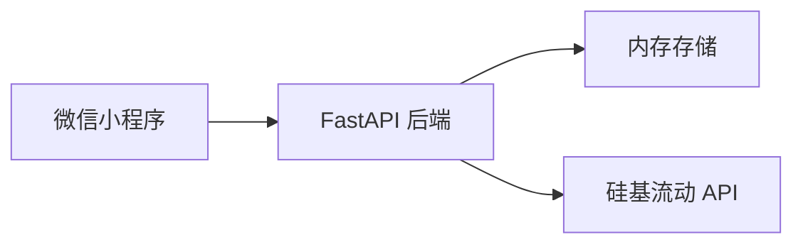
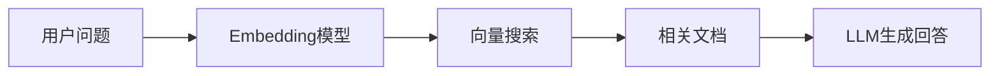
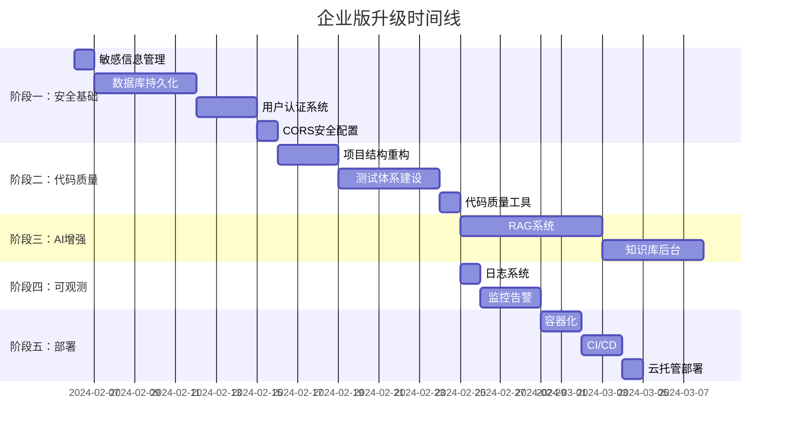

# 分销商FAQ系统 - MVP到企业级版本升级规划

> 本文档详细分析当前MVP系统的现状，并规划升级为可发布、可运行的企业级版本所需的全部工作。

---

## 📊 一、现状分析

### 当前系统架构



### 已实现功能

| 功能模块 | 实现状态 | 说明 |
|---------|---------|------|
| 每周答题 | ✅ MVP | 每周一 9 点随机5题，即时反馈 |
| 排行榜 | ✅ MVP | 实时积分排名 |
| AI问答 | ✅ MVP | 硅基流动大模型 |
| 用户管理 | ⚠️ 基础 | 随机ID，无真实认证 |

### MVP版本主要局限

| 领域 | 当前问题 | 风险程度 |
|------|---------|---------|
| **数据存储** | 内存存储，重启丢失 | 🔴 严重 |
| **用户认证** | 随机生成ID，无微信登录 | 🔴 严重 |
| **安全性** | API Key硬编码、CORS允许* | 🔴 严重 |
| **可观测性** | 无日志、无监控、无告警 | 🟡 中等 |
| **AI能力** | 简单关键词匹配，非RAG | 🟡 中等 |
| **运维部署** | 无Docker/CI-CD/健康检查 | 🟡 中等 |
| **代码质量** | 无测试、无类型检查 | 🟡 中等 |

---

## 🎯 二、企业级版本目标

### 2.1 质量要求

- **可用性**: 99.9% SLA，支持1000+日活用户
- **安全性**: 符合企业级安全标准，通过安全审计
- **可维护性**: 完善的文档、测试、监控体系
- **可扩展性**: 支持水平扩展，便于添加新功能

### 2.2 核心指标

| 指标 | MVP | 企业版目标 |
|------|-----|-----------|
| 数据持久化 | ❌ | ✅ PostgreSQL |
| 用户认证 | 随机ID | 微信OAuth |
| 并发支持 | ~10 | 500+ |
| 响应时间 | 无保证 | P95 < 500ms |
| 测试覆盖 | 0% | > 80% |

---

## 🔧 三、升级工作规划

### 阶段一：安全与基础设施（优先级：🔴 最高）

> [!CAUTION]
> 这些是生产上线的必要条件，必须首先完成。

#### 1.1 敏感信息管理

**当前问题**：API Key 硬编码在 `agent.py` 中

```python
# ❌ 当前做法 - 极度危险
SILICONFLOW_API_KEY = "sk-lrevmuzwivnsomdntfvvatvveiccmevvjibtdlntwqsscwom"
```

**升级方案**：
```python
# ✅ 正确做法
import os
from dotenv import load_dotenv

load_dotenv()
SILICONFLOW_API_KEY = os.getenv("SILICONFLOW_API_KEY")
```

**配置文件结构**：
```
faq-backend/
├── .env.example      # 模板文件，提交到Git
├── .env              # 实际配置，加入.gitignore
└── config.py         # 配置管理模块
```

**工作量**：1天

---

#### 1.2 数据库持久化

**当前问题**：内存存储（Dict），重启丢失全部数据

**升级方案**：使用 PostgreSQL + SQLAlchemy ORM

**新增文件结构**：
```
faq-backend/
├── alembic/              # 数据库迁移
│   └── versions/
├── alembic.ini
├── db/
│   ├── __init__.py
│   ├── session.py        # 数据库连接管理
│   └── models.py         # ORM模型定义
└── repositories/         # 数据访问层
    ├── __init__.py
    ├── user_repo.py
    ├── question_repo.py
    └── mistake_repo.py
```

**数据库表设计**：

```sql
-- 用户表
CREATE TABLE users (
    id UUID PRIMARY KEY DEFAULT gen_random_uuid(),
    openid VARCHAR(64) UNIQUE NOT NULL,  -- 微信OpenID
    nickname VARCHAR(100),
    avatar_url VARCHAR(500),
    total_score INT DEFAULT 0,
    correct_count INT DEFAULT 0,
    total_count INT DEFAULT 0,
    created_at TIMESTAMP DEFAULT CURRENT_TIMESTAMP,
    updated_at TIMESTAMP DEFAULT CURRENT_TIMESTAMP
);

-- 题目表
CREATE TABLE questions (
    id SERIAL PRIMARY KEY,
    content TEXT NOT NULL,
    options JSONB NOT NULL,
    correct_answer INT NOT NULL,
    explanation TEXT,
    category VARCHAR(50),
    difficulty INT DEFAULT 1,
    is_active BOOLEAN DEFAULT TRUE,
    created_at TIMESTAMP DEFAULT CURRENT_TIMESTAMP
);

-- 答题记录表
CREATE TABLE answer_records (
    id SERIAL PRIMARY KEY,
    user_id UUID REFERENCES users(id),
    question_id INT REFERENCES questions(id),
    selected_answer INT NOT NULL,
    is_correct BOOLEAN NOT NULL,
    score INT DEFAULT 0,
    time_spent INT,
    created_at TIMESTAMP DEFAULT CURRENT_TIMESTAMP
);

-- 错题表
CREATE TABLE mistakes (
    id SERIAL PRIMARY KEY,
    user_id UUID REFERENCES users(id),
    question_id INT REFERENCES questions(id),
    selected_answer INT NOT NULL,
    review_count INT DEFAULT 0,
    created_at TIMESTAMP DEFAULT CURRENT_TIMESTAMP,
    UNIQUE(user_id, question_id)
);

-- 索引
CREATE INDEX idx_users_openid ON users(openid);
CREATE INDEX idx_answer_records_user_id ON answer_records(user_id);
CREATE INDEX idx_answer_records_created_at ON answer_records(created_at);
CREATE INDEX idx_mistakes_user_id ON mistakes(user_id);
```

**工作量**：3-5天

---

#### 1.3 用户认证系统

**当前问题**：客户端生成随机ID，无法追踪真实用户

**升级方案**：对接微信小程序登录

**后端新增接口**：

```python
# routers/auth.py
@router.post("/api/auth/login")
async def wechat_login(code: str):
    """
    微信小程序登录流程:
    1. 小程序调用 wx.login() 获取 code
    2. 后端用 code 换取 openid + session_key
    3. 生成 JWT token 返回给小程序
    """
    # 调用微信接口
    wx_response = await get_wechat_session(code)
    openid = wx_response["openid"]
    
    # 创建或更新用户
    user = await user_repo.get_or_create(openid)
    
    # 生成 JWT
    token = create_access_token(user.id)
    
    return {"token": token, "user": user}
```

**小程序端修改**：

```javascript
// app.js
async login() {
    const { code } = await wx.login();
    const res = await this.request({
        url: '/api/auth/login',
        method: 'POST',
        data: { code }
    });
    wx.setStorageSync('token', res.token);
    this.globalData.userInfo = res.user;
}
```

**依赖项新增**：
```
python-jose==3.3.0    # JWT处理
passlib==1.7.4        # 密码加密（如需要）
```

**工作量**：2-3天

---

#### 1.4 CORS 安全配置

**当前问题**：
```python
# ❌ 允许所有来源
allow_origins=["*"]
```

**升级方案**：
```python
# ✅ 仅允许指定来源
ALLOWED_ORIGINS = [
    "https://servicewechat.com",  # 微信小程序
    "http://localhost:8080",       # 本地开发
]

app.add_middleware(
    CORSMiddleware,
    allow_origins=ALLOWED_ORIGINS,
    allow_credentials=True,
    allow_methods=["GET", "POST", "PUT", "DELETE"],
    allow_headers=["Authorization", "Content-Type"],
)
```

**工作量**：0.5天

---

### 阶段二：代码质量与测试（优先级：🟡 高）

#### 2.1 项目结构重构

**当前结构问题**：所有代码在少数几个文件中

**推荐企业级结构**：

```
faq-backend/
├── app/
│   ├── __init__.py
│   ├── main.py              # FastAPI 应用入口
│   ├── config.py            # 配置管理
│   ├── dependencies.py      # 依赖注入
│   │
│   ├── api/                  # API路由层
│   │   ├── __init__.py
│   │   ├── deps.py          # 路由依赖
│   │   └── v1/
│   │       ├── __init__.py
│   │       ├── router.py    # 路由汇总
│   │       ├── auth.py      # 认证接口
│   │       ├── questions.py # 题目接口
│   │       ├── users.py     # 用户接口
│   │       └── chat.py      # AI聊天接口
│   │
│   ├── core/                 # 核心模块
│   │   ├── __init__.py
│   │   ├── security.py      # JWT/加密
│   │   └── exceptions.py    # 自定义异常
│   │
│   ├── db/                   # 数据库层
│   │   ├── __init__.py
│   │   ├── session.py
│   │   └── models.py
│   │
│   ├── schemas/              # Pydantic模型
│   │   ├── __init__.py
│   │   ├── user.py
│   │   ├── question.py
│   │   └── chat.py
│   │
│   ├── services/             # 业务逻辑层
│   │   ├── __init__.py
│   │   ├── quiz_service.py
│   │   ├── ranking_service.py
│   │   └── ai_agent.py
│   │
│   └── repositories/         # 数据访问层
│       ├── __init__.py
│       ├── base.py
│       ├── user_repo.py
│       └── question_repo.py
│
├── tests/                    # 测试目录
│   ├── __init__.py
│   ├── conftest.py          # 测试配置
│   ├── unit/                # 单元测试
│   └── integration/         # 集成测试
│
├── alembic/                  # 数据库迁移
├── scripts/                  # 运维脚本
├── Dockerfile
├── docker-compose.yml
├── requirements.txt
├── requirements-dev.txt
└── pyproject.toml
```

**工作量**：2-3天

---

#### 2.2 测试体系建设

**测试类型与覆盖目标**：

| 测试类型 | 覆盖目标 | 工具 |
|---------|---------|------|
| 单元测试 | Services层 ≥80% | pytest |
| 集成测试 | API端到端 100% | pytest + httpx |
| 性能测试 | 压力场景 | locust |

**示例测试代码**：

```python
# tests/unit/test_quiz_service.py
import pytest
from app.services.quiz_service import QuizService

class TestQuizService:
    def test_calculate_score_correct_fast(self):
        """快速正确答题应获得15分"""
        score = QuizService.calculate_score(
            is_correct=True, 
            time_spent=5
        )
        assert score == 15  # 10 + 5

    def test_calculate_score_correct_slow(self):
        """慢速正确答题应获得10分"""
        score = QuizService.calculate_score(
            is_correct=True, 
            time_spent=60
        )
        assert score == 10

    def test_calculate_score_wrong(self):
        """错误答题不得分"""
        score = QuizService.calculate_score(
            is_correct=False, 
            time_spent=5
        )
        assert score == 0
```

```python
# tests/integration/test_api_questions.py
import pytest
from httpx import AsyncClient
from app.main import app

@pytest.mark.asyncio
async def test_get_questions():
    async with AsyncClient(app=app, base_url="http://test") as client:
        response = await client.get("/api/questions?count=5")
        assert response.status_code == 200
        data = response.json()
        assert data["code"] == 0
        assert len(data["data"]) == 5
```

**依赖项新增**（requirements-dev.txt）：
```
pytest==7.4.3
pytest-asyncio==0.23.2
pytest-cov==4.1.0
httpx==0.26.0
locust==2.20.0
```

**工作量**：3-5天

---

#### 2.3 代码质量工具

**Linting 与格式化配置**：

```toml
# pyproject.toml
[tool.black]
line-length = 88
target-version = ['py38']

[tool.isort]
profile = "black"

[tool.mypy]
python_version = "3.8"
strict = true

[tool.ruff]
select = ["E", "F", "W", "I", "N", "UP", "B"]
```

**Pre-commit 配置**：

```yaml
# .pre-commit-config.yaml
repos:
  - repo: https://github.com/psf/black
    rev: 23.12.0
    hooks:
      - id: black

  - repo: https://github.com/pycqa/isort
    rev: 5.13.2
    hooks:
      - id: isort

  - repo: https://github.com/pre-commit/mirrors-mypy
    rev: v1.7.1
    hooks:
      - id: mypy
```

**工作量**：1天

---

### 阶段三：AI能力增强（优先级：🟡 中）

#### 3.1 真正的RAG系统

**当前问题**：简单关键词匹配，效果差

```python
# ❌ 当前做法
def search_knowledge(query: str):
    for doc in KNOWLEDGE_BASE:
        if any(keyword in doc["title"] for keyword in query.split()):
            results.append(doc)
```

**升级方案**：向量数据库 + Embedding



**技术选型**：
- **向量数据库**: Qdrant（开源）或 Milvus
- **Embedding**: 硅基流动 Embedding API 或 text2vec
- **分块策略**: 按段落分块，重叠50字

**新增代码结构**：
```
app/
└── rag/
    ├── __init__.py
    ├── embeddings.py      # Embedding生成
    ├── vector_store.py    # 向量数据库操作
    ├── chunker.py         # 文档分块
    └── retriever.py       # 检索器
```

**示例代码**：
```python
# app/rag/retriever.py
from qdrant_client import QdrantClient

class RAGRetriever:
    def __init__(self):
        self.client = QdrantClient(host="localhost", port=6333)
        
    async def search(self, query: str, top_k: int = 3) -> list:
        # 生成查询向量
        query_vector = await self.get_embedding(query)
        
        # 向量搜索
        results = self.client.search(
            collection_name="knowledge_base",
            query_vector=query_vector,
            limit=top_k
        )
        
        return [hit.payload for hit in results]
```

**工作量**：5-7天

---

#### 3.2 知识库管理后台

**功能需求**：
- 知识点CRUD
- 批量导入（Excel/Word）
- 分类管理
- 自动向量化

**技术方案**：可选 Streamlit 或 Gradio 快速搭建

**工作量**：3-5天

---

### 阶段四：可观测性（优先级：🟡 中）

#### 4.1 日志系统

**升级方案**：结构化日志 + 集中收集

```python
# app/core/logging.py
import structlog

structlog.configure(
    processors=[
        structlog.processors.TimeStamper(fmt="iso"),
        structlog.processors.JSONRenderer()
    ]
)

logger = structlog.get_logger()

# 使用示例
logger.info("user_login", user_id=user_id, method="wechat")
```

**日志格式**：
```json
{
    "timestamp": "2024-02-05T10:30:00Z",
    "level": "info",
    "event": "user_login",
    "user_id": "xxx",
    "trace_id": "abc123"
}
```

**工作量**：1天

---

#### 4.2 监控与告警

**核心监控指标**：

| 类型 | 指标 | 阈值 |
|------|------|------|
| 应用 | 请求延迟P95 | < 500ms |
| 应用 | 错误率 | < 1% |
| 应用 | QPS | 告警 > 100 |
| 系统 | CPU使用率 | < 80% |
| 系统 | 内存使用率 | < 85% |
| 业务 | 日活用户 | 监控趋势 |

**技术选型**：
- **指标收集**: Prometheus + FastAPI Instrumentator
- **可视化**: Grafana
- **告警**: Grafana Alerting 或企业微信机器人

**依赖项新增**：
```
prometheus-fastapi-instrumentator==6.1.0
```

**代码集成**：
```python
# app/main.py
from prometheus_fastapi_instrumentator import Instrumentator

Instrumentator().instrument(app).expose(app)
```

**工作量**：2-3天

---

### 阶段五：部署与运维（优先级：🟡 高）

#### 5.1 容器化

**Dockerfile**：

```dockerfile
# Dockerfile
FROM python:3.11-slim

WORKDIR /app

# 安装依赖
COPY requirements.txt .
RUN pip install --no-cache-dir -r requirements.txt

# 复制应用
COPY app/ app/
COPY alembic/ alembic/
COPY alembic.ini .

# 运行
CMD ["uvicorn", "app.main:app", "--host", "0.0.0.0", "--port", "8000"]
```

**docker-compose.yml**：

```yaml
version: '3.8'

services:
  api:
    build: .
    ports:
      - "8000:8000"
    environment:
      - DATABASE_URL=postgresql://user:pass@db:5432/faq
      - SILICONFLOW_API_KEY=${SILICONFLOW_API_KEY}
    depends_on:
      - db
      - redisredis
    healthcheck:
      test: ["CMD", "curl", "-f", "http://localhost:8000/health"]
      interval: 30s
      timeout: 10s
      retries: 3

  db:
    image: postgres:15-alpine
    volumes:
      - postgres_data:/var/lib/postgresql/data
    environment:
      - POSTGRES_DB=faq
      - POSTGRES_USER=user
      - POSTGRES_PASSWORD=pass

  redis:
    image: redis:7-alpine
    volumes:
      - redis_data:/data

volumes:
  postgres_data:
  redis_data:
```

**工作量**：1-2天

---

#### 5.2 CI/CD 流水线

**GitHub Actions 配置**：

```yaml
# .github/workflows/ci.yml
name: CI/CD Pipeline

on:
  push:
    branches: [main, develop]
  pull_request:
    branches: [main]

jobs:
  test:
    runs-on: ubuntu-latest
    steps:
      - uses: actions/checkout@v4
      
      - name: Set up Python
        uses: actions/setup-python@v5
        with:
          python-version: '3.11'
          
      - name: Install dependencies
        run: |
          pip install -r requirements.txt
          pip install -r requirements-dev.txt
          
      - name: Lint
        run: ruff check .
        
      - name: Type Check
        run: mypy .
        
      - name: Test
        run: pytest --cov=app tests/

  deploy:
    needs: test
    if: github.ref == 'refs/heads/main'
    runs-on: ubuntu-latest
    steps:
      - name: Deploy to WeChat Cloud
        run: echo "Deploy to production"
```

**工作量**：1-2天

---

#### 5.3 微信云托管部署

**配置文件**：

```json
// container.config.json
{
    "minNum": 1,
    "maxNum": 5,
    "cpuSize": 0.5,
    "memSize": 1,
    "containerPort": 8000,
    "envParams": {
        "DATABASE_URL": "${database_url}",
        "SILICONFLOW_API_KEY": "${api_key}"
    },
    "customLogs": "stdout"
}
```

**工作量**：1天

---

### 阶段六：功能增强（优先级：🟢 低）

> 这些功能在核心稳定后可逐步添加

#### 6.1 个性化推荐

- 基于用户错题率推荐薄弱知识点
- 难度自适应调整
- 学习路径规划

#### 6.2 学习报告

- 每周/每月学习报告
- 知识点雷达图
- 进步趋势分析

#### 6.3 社交功能

- 好友PK
- 战队系统
- 成就徽章

#### 6.4 内容管理

- 管理后台（题目/知识库管理）
- 批量导入导出
- 审核流程

---

## 📅 四、实施计划

### 时间线（推荐）



### 工作量汇总

| 阶段 | 预估工时 | 优先级 |
|------|---------|--------|
| 阶段一：安全与基础设施 | 7-10天 | 🔴 必须 |
| 阶段二：代码质量 | 6-9天 | 🟡 重要 |
| 阶段三：AI增强 | 8-12天 | 🟡 重要 |
| 阶段四：可观测性 | 3-4天 | 🟡 重要 |
| 阶段五：部署运维 | 4-6天 | 🟡 重要 |
| 阶段六：功能增强 | 待定 | 🟢 可选 |

**总计**：约 28-41 个工作日（1.5-2个月）

---

## 💰 五、成本估算

### 基础设施成本（月）

| 资源 | 规格 | 预估费用 |
|------|------|---------|
| 微信云托管 | 0.5核1G × 2实例 | ¥100-200 |
| PostgreSQL | 1核2G（云托管） | ¥50-100 |
| 向量数据库 | Qdrant 1核2G | ¥100-200 |
| 硅基流动API | 按量付费 | ¥50-200 |

**月度总成本**：约 ¥300-700

### 开发成本

| 类型 | 估算 |
|------|------|
| 外包开发 | ¥30,000-50,000 |
| 自主开发 | 1.5-2个月人工 |

---

## ✅ 六、上线Checklist

### 安全检查
- [ ] API Key 已从代码中移除，使用环境变量
- [ ] CORS 配置仅允许必要来源
- [ ] 所有API启用JWT认证
- [ ] 敏感数据已加密存储
- [ ] SQL注入防护已验证

### 质量检查
- [ ] 单元测试覆盖率 > 80%
- [ ] 所有API集成测试通过
- [ ] 性能测试（100并发）通过
- [ ] 代码审查已完成

### 运维检查
- [ ] 日志收集已配置
- [ ] 监控仪表盘已搭建
- [ ] 告警规则已设置
- [ ] 健康检查接口可用
- [ ] 数据库备份策略已配置

### 小程序检查
- [ ] 服务器域名已配置
- [ ] HTTPS证书已部署
- [ ] 小程序审核已通过
- [ ] 灰度发布计划已制定

---

## 📚 七、参考资源

### 官方文档
- [FastAPI 最佳实践](https://fastapi.tiangolo.com/advanced/)
- [微信小程序登录](https://developers.weixin.qq.com/miniprogram/dev/framework/open-ability/login.html)
- [微信云托管文档](https://developers.weixin.qq.com/miniprogram/dev/wxcloudrun/src/basic/intro.html)

### 推荐学习
- [12-Factor App 原则](https://12factor.net/zh_cn/)
- [Python Clean Architecture](https://github.com/cosmicpython/book)

---

> 📝 **文档版本**: v1.0  
> 📅 **创建日期**: 2024-02-05  
> 👤 **作者**: AI Assistant
