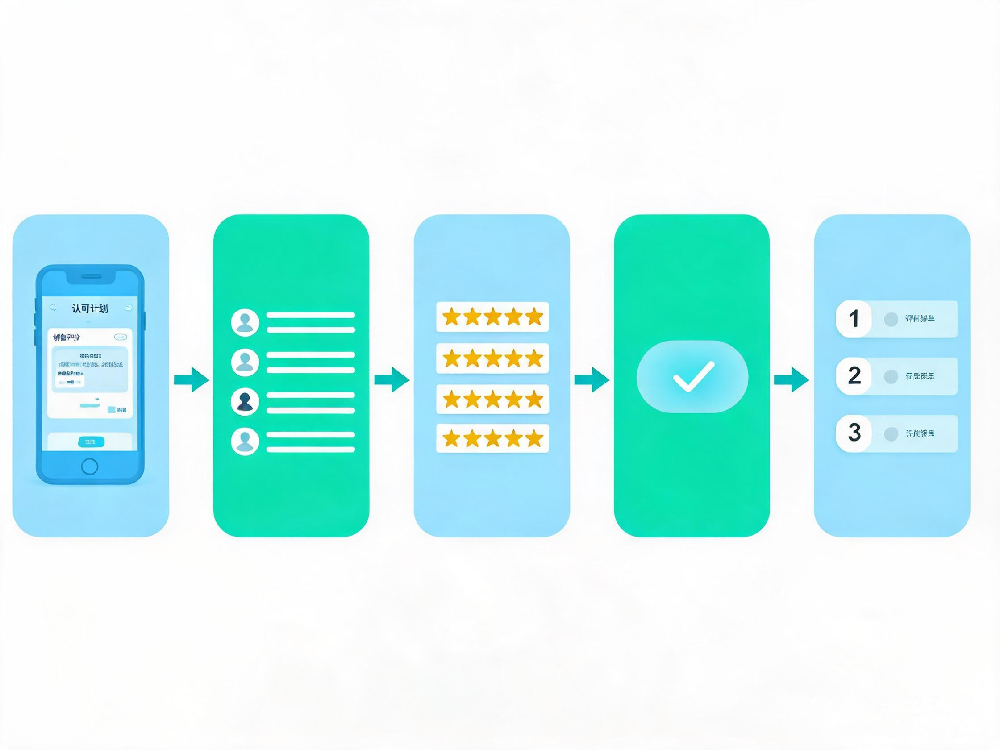
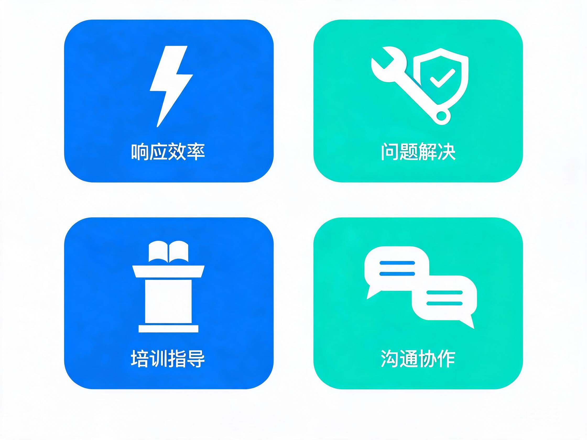

# 销售给渠道专员评分指引

> 面向：销售同事 ｜ 周期：每月一次 ｜ 平台：企业微信小程序「认可计划 — 销售评分」
> 用途：评估上个月与你对接的渠道专员的月度服务表现，结果用于月度/季度评优与积分奖励。

---

## 一、评分总览

每个自然月月初，销售需**从全部渠道专员中自行选择上个月与你有对接过的专员**，从四个维度打分（1~5 分，0 分表示 N/A）。**评分人数不限**，评多少位都可以提交。

**为什么需要评分？**
- 帮助专员持续改进服务：处理报备更快、解决更专业、培训更实用、配合更顺畅；
- 评分结果（月均值、中位数）是月度评优、积分奖励的重要依据；
- 你的评分是**匿名汇总**的，专员端看不到是谁打的，请放心客观评价。

---

## 二、评分前置条件

开始评分前，请确认：

| 条件 | 说明 |
|---|---|
| 可评分专员 | 系统展示全部专员，销售自行选择评分，**人数不限** |
| 评分月份 | 页面显示上月（如 `2026-08`） |
| 每月一次 | 每位专员**每自然月只能评一次，提交后不可修改** |
| 账号权限 | 需以「销售」角色登录；其他角色无评分入口 |

若进入页面提示"暂无可评分专员"，请联系管理员确认专员账号已配置。

---

## 三、操作步骤

### 第 1 步：进入评分页面
企业微信 → 小程序「认可计划」→ 点击 **「销售对渠道专员满意度评分」**。（首页或认可计划菜单入口）

### 第 2 步：确认评分月份
页面顶部显示评分月份（如 `2026-08`，即上月），并提示"请选择上个月与你有对接过的渠道专员，逐位进行评分"。

### 第 3 步：选择并逐位打分
点击专员卡片 **「选择评分」**，展开后按四个维度逐项打分。**每位专员的每个评分项都必须选择**（1~5 分，或选择 N/A）后才能提交。

**四个评分维度（锚点参考）：**

**① 报备处理效率**
- 5分（超出预期）：报备批复快速专业，主动跟进提醒，提前预警潜在问题和冲突
- 3分（符合预期）：按时批复，一般情况下无延误
- 1分（远低于预期）：经常延迟批复，需多次催促，影响项目推进

**② 沟通顺畅程度**
- 5分：沟通高效，信息准确，态度积极，能换位思考
- 3分：沟通正常，信息基本准确，态度友好
- 1分：沟通不畅，信息有误，态度消极

**③ 分销商诉求响应**
- 5分：主动预判需求，提前解决问题，分销商多次表扬
- 3分：及时响应，按需支持，基本满足诉求
- 1分：响应迟缓，问题搁置，分销商投诉

> 💡 如名下无对接分销商，可选择N/A

**④ 分销商赋能培训支持**
- 5分：主动提供有价值的市场/产品/政策信息，积极推动分销商参与赋能，切实有效地提升了分销商能力
- 3分：按照公司要求为分销商提供赋能
- 1分：没有为分销商提供赋能

> 💡 如名下无对接分销商，可选择N/A

> ⚠️ 系统校验：每位选中的专员**四个评分项全部选择**后才能提交；已评分卡片显示"已评分"，不可再改。

### 第 4 步：提交评分
确认无误后点击底部 **「提交评分」**，系统会逐位提交所选专员的评分并提示"评分提交成功"；提交后留在页面，已评卡片变"已评分"，可继续选择其余专员评分。

### 第 5 步：查看结果
- **专员端**：看到的是匿名汇总（各维度平均分、中位数总分、评分人数），不显示打分人；
- **经理端**：可查看带提交人的完整明细分。

---

## 四、评分原则（建议）

为保证评分公平有效、为评优提供可靠依据：

1. **基于事实**：以当月真实对接记录、报备处理、培训辅导为据，不凭印象或关系打分；
2. **拉开区分度**：避免全员 5 分，优秀与待改进应有所区分；
3. **及时完成**：每月初及时完成上月评分，逾期后当月不可补交；
4. **只看维度**：不要因一件小事全维度打低分，按各维度实际表现独立评价。

---

## 五、常见问题

**Q1：已经提交了，还能改吗？**
不能。系统按「销售+专员+月份」唯一约束，提交后不可修改；如确有弄错，请联系经理/管理员核查处理。

**Q2：某位专员上个月几乎没对接，怎么打分？**
对接不涉及的维度可以选择 N/A（0 分）。但每位专员的**四个评分项都必须做出选择**（打分或 N/A），否则无法提交。

**Q3：名下没有对接分销商，怎么评分？**
「分销商诉求响应」「分销商赋能培训支持」两项可选择 N/A；其余两项按专员实际表现打分。

**Q4：我想评的专员不在列表里？**
系统展示的是全部「专员」角色账号；若目标人员未显示，请确认其账号角色已设为专员，或联系管理员核查。

**Q5：评分结果在哪里看？**
评分次月在认可计划中查看排名与评优公示；经理可追溯当月评分明细分。

---

*本指引依据系统实际功能编写：每月一次、四大维度（1~5 分、0=N/A）、自行选择专员（人数不限）、每项必选、提交后不可修改。*
